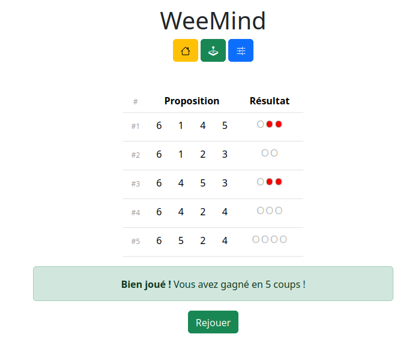

# WeeMind

## WeeMind est un jeu de MasterMind 

Cette implémentation PHP simple est un exercice de structuration d'un code PHP simple sans framework ni composer a des fins de démonstration technique et ludique.

Le code est architecturé en MVC :  

* Models dans le dossier model
* dans view un sustème de blocs HTML est proposé même si il reste trop simple pour un usage a grande echelle il a le mériqte de séparer la partie rendu de la partie logique.
* La partie controlleur est elle auisi ultra simple.

L'autoloader manuel est basique mais permet de faire le travail.  
Le code métier est volontairement découpé avec de l'abstraction et de l'heritage là aussi a des fins pédagogiques.  
Le rendu HTML est utlra simple mais fonctionnel.  
La persistance de la partie se fait en session, la classe abstraite Persister permet d'entrvoir un stockage dans un fichier, dans une BDD ou autre

### Note sur les regles du jeu

J'ai délibérément choisi une génération de code qui peut créer des "doublons" par exemple 5266  
Cela implique de donner une information au joeur pour qu'il puisse le comprendre, et la génération des pions rouges 
(le bon chiffre au mauvais endroit) se fait donc en parcourant la combinaison secrete et non la combinaison proposée
dans la boucle principale. cela dera que la proposition 6134 pour le secret 5266 donnera 2 pions rouges pour les deux 6
et la proposition 1346 donnera 1 blanc et 1 rouge pour les deux 6  
Sans cette façon de compter les pions il est très difficile de voir qu'il y a un doublon, et sans doublons il est beaucoup plus facile de gagner

## installation

**Prérequis** : 

- PHP7.0+ 
- un système de reecritures d'url
- une execution a la racine du vhost *(l'execution dans un sous dossier menera sans doute a des erreurs pour cause de liens absolus, je n'ai pas testé, c'est facile a corriger, mais pas de temps a perdre pour cet exercice)*

Sous apache un `.htaccess` est fourni.

Le jeu peut aussi etre lancé avec la commande `php -S localhost:12345`

## Pistes d'amélioration : 

* Mieux documenter le code (phpdoc à compléter)
* Remplacer les chiffres par des couleurs ou des symboles
* Prévoir une version ligne de commande !

## A quoi ça ressemble :

Démo live : http://weemind.alexlamoureux.fr/play